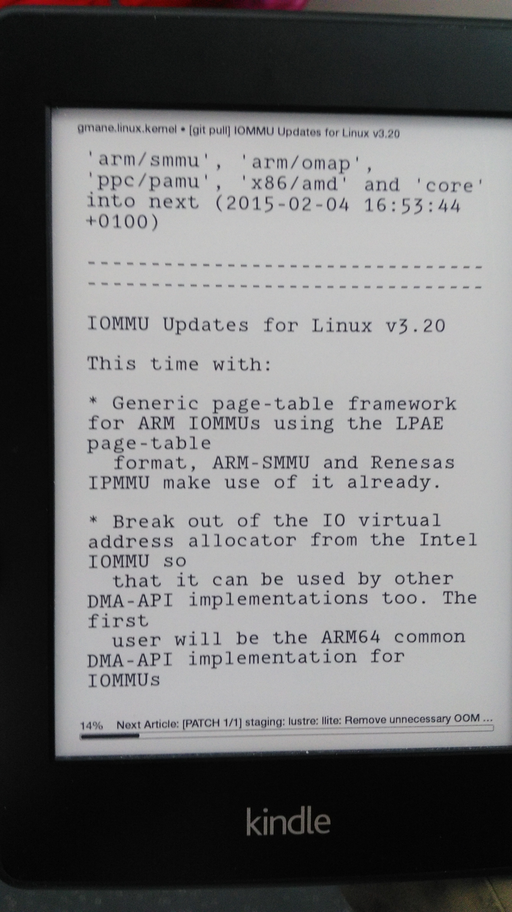
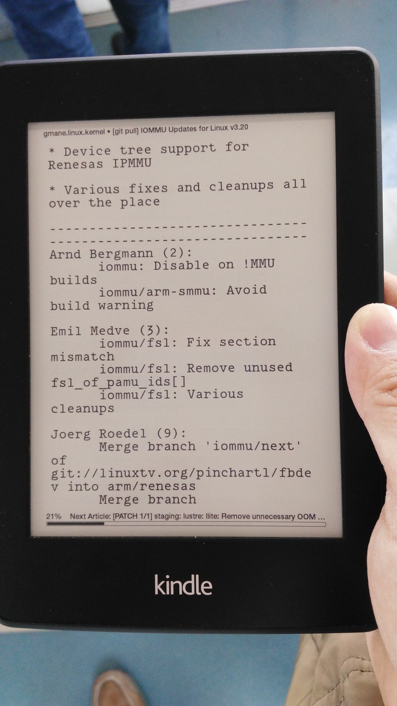

Kindle，evernote, 工作日志
======================

自己参与社区的小体会，分享我平时用kindle看社区邮件，做笔记，与evernote同步。以及工作日志。

参与社区小体会
--------

渠道：邮件列表，IRC，wiki，会议等等。

邮件列表大家都很熟悉了，这里面信息量很大，大致有以下内容。

社区这事儿，大家都知道要贡献代码，问题是我一个社区新人，该贡献什么呢？怎么把工作和贡献社区结合起来？这都需要了解社区的动向。

大的方面说社区的计划会用：roadmap, todo list等形式在mailing list或wiki上列出。

比如说这里有某个虚拟化社区（xen）的路线图:

比如说xen 4.5的roadmap里面有release manager, timeline, feature owner等内容.

这时候你可能会发现wiki的内容有点旧了, 现在已经在开发xen 4.6了. 没关系啊, 这就是咱们参与社区的机会: 可以帮助社区完善文档(参考后面的Documents day).
[这里](https://www.mail-archive.com/xen-devel@lists.xen.org/msg06993.html)可以找到xen 4.6的release manager.

irc, mailing list. roadmap, patch are welcome, docoment day, testday.
todo list, gsoc, opw（已改名）

例如git pull会包含特性的修改，

子系统的主要贡献者

日志基本分为印象笔记负责的移动笔记和围绕markdown的工作日志。
 
Kindle用来看社区邮件，rss，记录自己感兴趣的内容或邮件。笔记通过kindle笔记导入到印象笔记。邮件通过狗耳朵直接发到印象笔记。

看社区邮件列表，看rss。
选型：kindle4rss, dogear（狗耳朵）, 自己用gae做。
狗耳朵支持发送到evernote。但对邮件数量有限制（原来是50封现在我沟通到80封），内核邮件收不全。各子系统的邮件能收全，暂时凑合了。自己用gae应该没这个问题。话说我将来希望kindle上做标记的邮件和gmail能同步：其实就是用gmail api读写gmail的标签和星标，不知道有没有小朋友用过。

clippings.io

Lwn.net: weekly, 内核除了内核文档，可以搜索这个。
比如今天提到pstore，google搜索“pstore lwn”可以搜索到三篇介绍文章。

工作日志举例：“vi make”.
 
Kindle看信：gmane

相关链接
http://sendtoreader.com/
kindle4rss
dogear
gae kindle

[IFTTT is pronunced like "gift" without the "g"](https://ifttt.com/wtf)

网站推荐：Infoq中文站。[订阅](newsletter@mailer.infoq.com)

参考资料
who write Linux 2015
印象笔记：如何参与社区.

