Kindle，evernote, 工作日志
======================

自己参与社区的小体会，分享我平时用kindle看社区邮件，做笔记，与evernote同步。以及工作日志。

参与社区小体会
========

渠道：邮件列表，IRC，wiki，会议等等。
关键字: irc, mailing list. roadmap, patch are welcome, docoment day, testday.  todo list, gsoc, opw(已改名outreachy), bugzilla.

邮件列表大家都很熟悉了，这里面信息量很大，大致有以下内容。

关注社区动向: 需要做啥?
------------

### Roadmap, TODO list

社区这事儿，大家都知道要贡献代码，问题是我一个社区新人，该贡献什么呢？怎么把工作和贡献社区结合起来？这都需要了解社区的动向。

大的方面说社区的计划会用：roadmap, todo list等形式在mailing list或wiki上列出。

比如说这里有某个虚拟化社区（xen）的路线图:
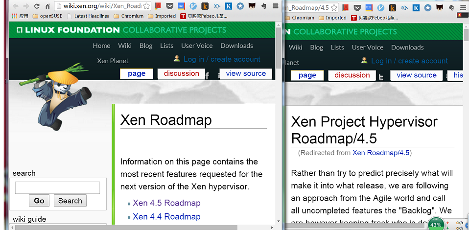
比如说xen 4.5的roadmap里面有release manager, timeline, feature owner等内容.
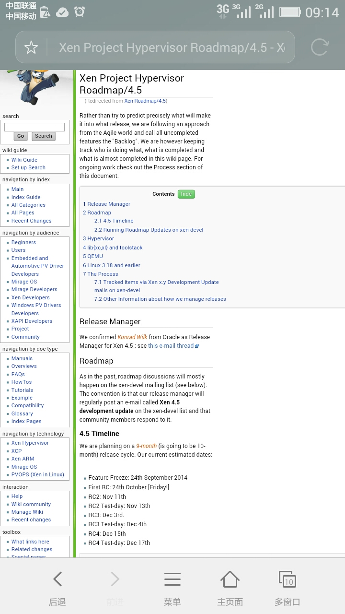

这时候你可能会发现wiki的内容有点旧了, 现在已经在开发xen 4.6了. 没关系啊, 这就是咱们参与社区的机会: 可以帮助社区完善文档(参考后面的Documents day).

[这里](https://www.mail-archive.com/xen-devel@lists.xen.org/msg06993.html)可以找到xen 4.6的release manager是Citrix的Wei LIU, 如果是xen 4.6的开发事宜, 可以关注liu wei的言论(mailing list, irc, conference, submit...), 实在不行也可以在irc上直接骚扰他.

### GSOC和Outreachy

有时候咱们知道了社区的规划，这里面看到的点比较大，有没有一些比较容易上手的点呢?
我觉得可以参考google资助的GSOC(Google Summer of Code)和GNOME资助的Outreachy(之前是OPW: Outdoor Program for Women). GSOC本身是针对学生的项目，要求是学生在3-4个月时间可以完成的coding任务, 社区可能没有刷新TODO list, 但是GSOC每年是社区重新向google申请, 相对来说这里面列出的任务都是社区确实需要, 但是maintainer自己又没空/不想做的.

每年GSOC的流程是: 社区向google申请成为GSOC组织 -> 社区根据学生能力匹配程度筛选GSOC project. 被选中的概率并不高, 我感觉不会超过20%.
例如[这里](https://en.opensuse.org/openSUSE:GSOC_ideas)可以看到opensuse GSOC projects, 
自己宣传一下[我申请的项目](https://en.opensuse.org/openSUSE:GSOC_ideas#Build_Service:_Add_ARM64_ILP32_support_for_obs), 如果有师弟师妹有兴趣, 可以联系我.

Outreachy前身是GNOME发起的OPW(Outdoor Program for Women), 本来是为了鼓励女性出来工作, 现在演化为Outready没有性别限制, [这里](http://sarah.thesharps.us/2014/08/27/2014-kernel-internship-report-opw/)是opw项目的介绍, 这个是kernel社区去年和今年的项目([2015-2016](http://kernelnewbies.org/OutreachyIntro), [2014-2015](http://kernelnewbies.org/OPWRound9)).

不管GSOC还是Outreachy, 对于参与者都是有报酬的, 希望参与者能全职参与社区, 印象中是5000$左右. GSOC对于mentor资助很少.

如果看mailing list, 有时讨论问题的时候, 有些事情可能大家觉得需要做, 但是又没有人去做, 这可能都是咱们去参与的机会.

关注社区动向: 刚刚做了啥?
------------

参与社区有时候会觉得社区发展很快, 如果想知道一些旧闻, 各种书, 各种博客都有很多资料. 怎么知道刚刚做的啥?
比如说和我工作相关的子系统, 可能平时没有精力关注的很细, 可以看看git pull, 还有其他人整理的社区动态.

### GIT PULL

例如git pull会包含特性的修改，
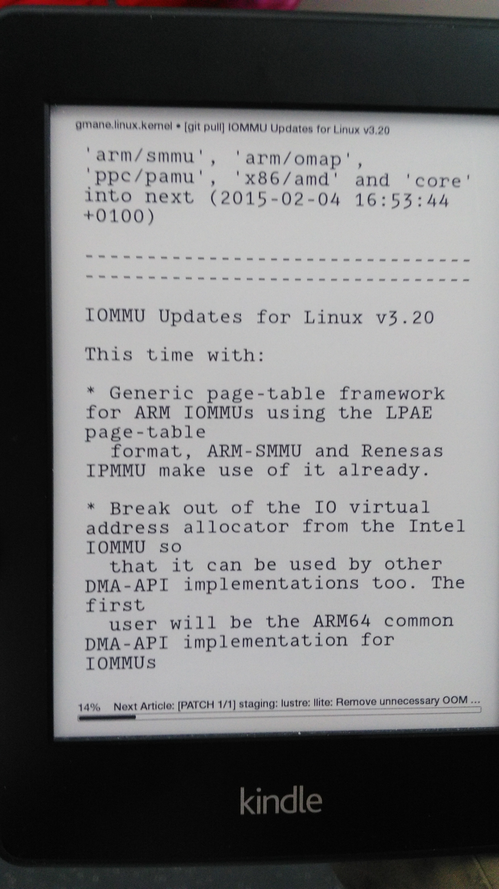
子系统的主要贡献者

也有人会介绍, 比如phoronix上面会有人分析子系统git pull request(pr):
例如btrfs最近对raid5/6改善的pr:
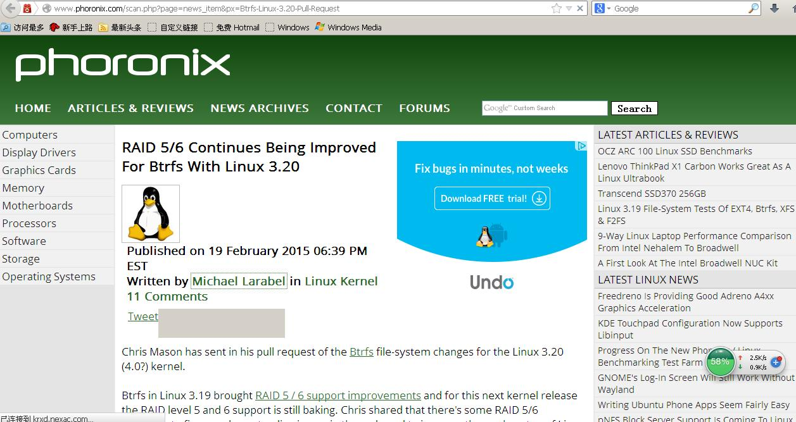
这个是Greg KH的pr:
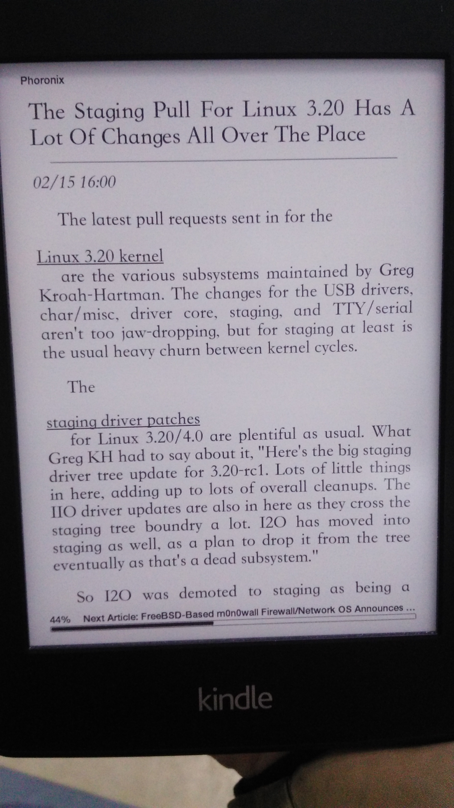

### 社区的历史

如何想了解社区动态, 天天看pr可能会让咱们这种小白感觉陷入细节. 你告诉我现在改了啥, 这挺好, 问题是我不知道原来是啥样, 知道delta也没用啊.
TODO: 加入视频的残差.

前段时间看到Neil Brown写了cgroup的历史和现状:
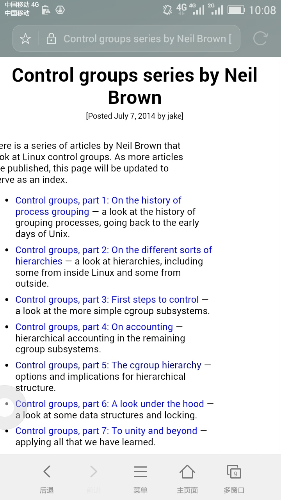

有时社区为了重构某些代码, 会写一些资料, 例如这个要重构调度器子系统的.
这里也可以看到几个信息来源: lwn, linaro core dump, kernel submit...
*   By  Nicolas Pitre:
    *   [Teaching the scheduler about power management](http://lwn.net/Articles/602479/)
    *   [The Road to Energy-Aware Scheduling](http://www.linaro.org/blog/core-dump/road-energy-aware-scheduling/)
*   By Amit Kucheria:
    *   [http://www.linaro.org/blog/core-dump/energy-aware-scheduling-eas-project/](Energy-Aware Scheduling (EAS) Project)
*   By Jonathan Corbet
    *   [Power-aware scheduling meets a line in the sand](http://lwn.net/Articles/552885/)
*   同一个会议也有两个人写总结, Summary of Energy-Aware Scheduling workshop, Linux Kernel Summit 2014:
    *   [By Mike Turquette from Linaro Core Dump](https://www.linaro.org/blog/core-dump/summary-energy-aware-scheduling-workshop-linux-kernel-summit-2014/)
    *   [By Jonathan Corbet from lwn](http://lwn.net/Articles/609969/)

### 社区新闻: lwn, phoronix... 

#### kernel动态
TODO 八卦一下Jonathan Corbet.

不知道大家是怎么关注内核开发状态的，我主要通过lwn, phonorix了解。
lwn上3.20 merge window:
[The 3.20 merge window opens](https://lwn.net/Articles/632761/):
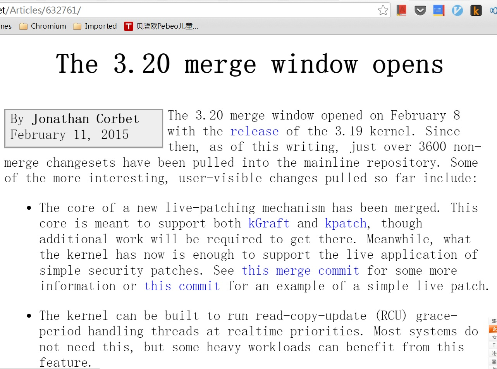
[3.20 merge window part 2](https://lwn.net/Articles/633096/):
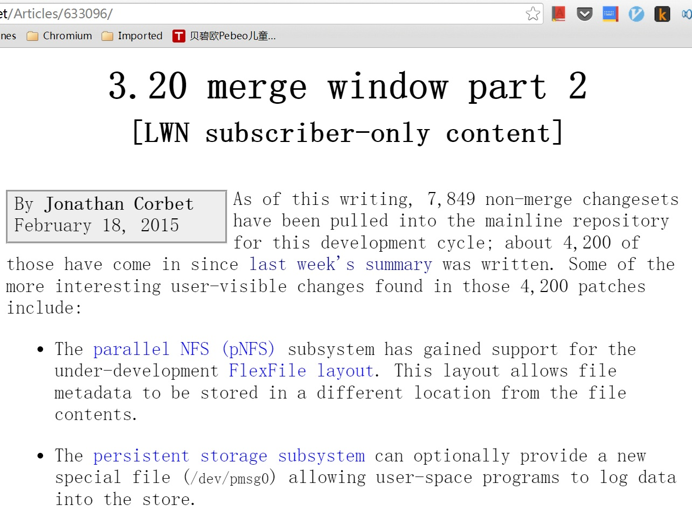

phonorix上分析的4.0 rc1为止的内核特性列表:
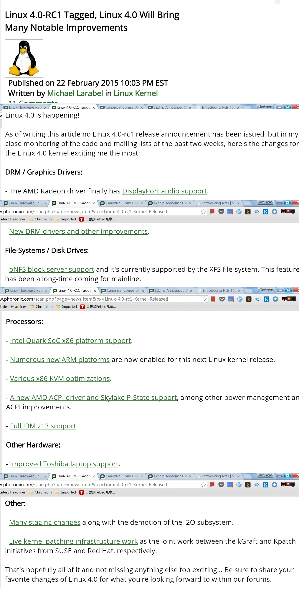

另外kernel newbies有每个release内核的特性列表
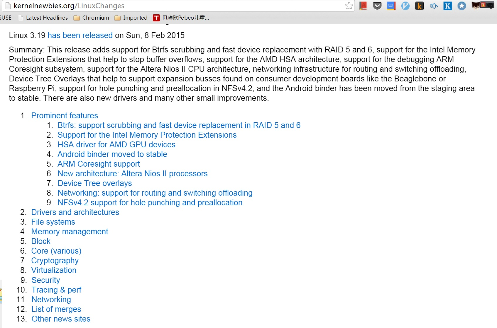

其它
--
参与社区的机会还包括参加社区的test day帮忙测试，参加社区的documents day帮忙完善文档。

社区的会议

看邮件累了，也可以去youtube看看视频，也可以看看slideshare上面的胶片。

移动生活
========

*   看社区动态主要利用零碎的时间.
    *    每天在家, 路上, 公司切换.
    *    关注社区动态, 一般来说对工作没有**直接**帮助, 利用整块的工作时间不化算.

*   关注的动态希望能够积累, 易于搜索.

    Opensource.com
linux.com Linux Kernel Development News
(InfoQ)[http://www.infoq.com/]
(Phoronix)[http://www.phoronix.com]
(Hacker News)[https://news.ycombinator.com/]
(Linaro Core Dump)[http://www.linaro.org/blog/core-dump/]

    gmane.linux.linaro.announce
    gmane.linux.linaro.devel
    gmane.linux.linaro.toolchain

    gmane.linux.kernel.containers
    gmane.linux.kernel.cgroups
    gmane.linux.suse.opensuse.devel
    gmane.comp.lib.glibc.alpha
    gmane.linux.kernel
    gmane.linux.kernel.arm
    gmane.linux.ports.arm.kernel
    gmane.comp.emulators.qemu
    gmane.comp.emulators.xen.devel

kindle技巧
----

evernote技巧
----

以下为草稿
====

日志基本分为印象笔记负责的移动笔记和围绕markdown的工作日志。
 
Kindle用来看社区邮件，rss，记录自己感兴趣的内容或邮件。笔记通过kindle笔记导入到印象笔记。邮件通过狗耳朵直接发到印象笔记。

看社区邮件列表，看rss。
选型：kindle4rss, dogear（狗耳朵）, 自己用gae做。
狗耳朵支持发送到evernote。但对邮件数量有限制（原来是50封现在我沟通到80封），内核邮件收不全。各子系统的邮件能收全，暂时凑合了。自己用gae应该没这个问题。话说我将来希望kindle上做标记的邮件和gmail能同步：其实就是用gmail api读写gmail的标签和星标，不知道有没有小朋友用过。

clippings.io

Lwn.net: weekly, 内核除了内核文档，可以搜索这个。
比如今天提到pstore，google搜索“pstore lwn”可以搜索到三篇介绍文章。
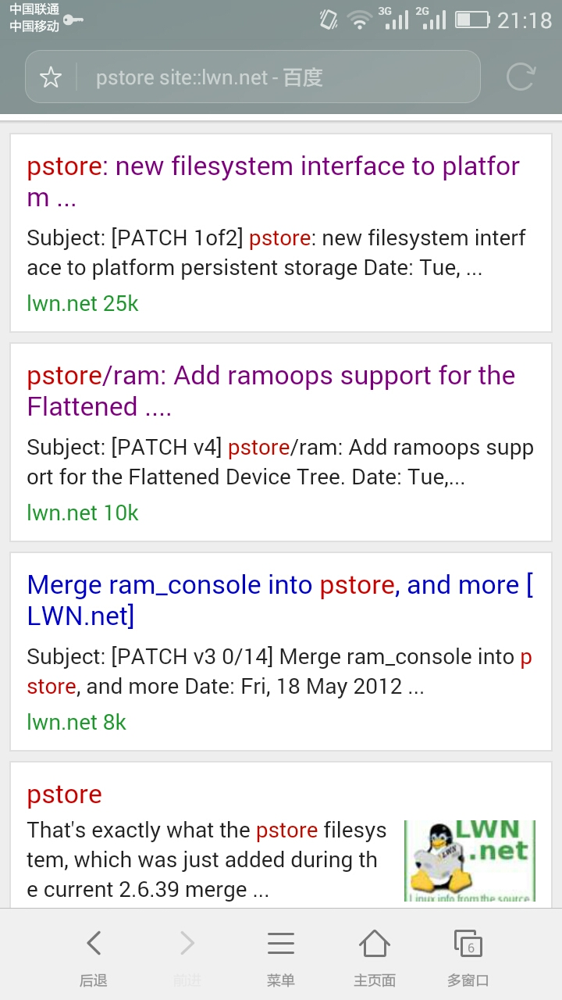
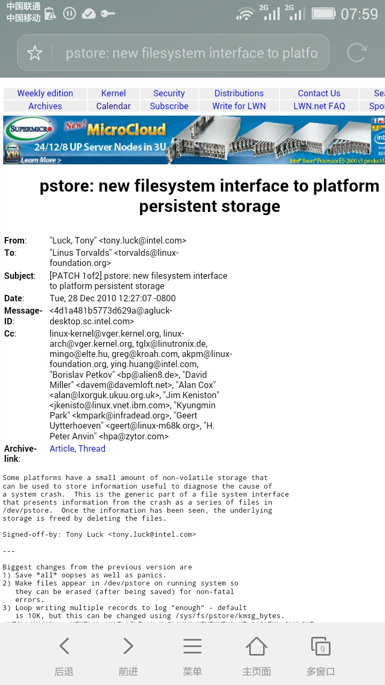
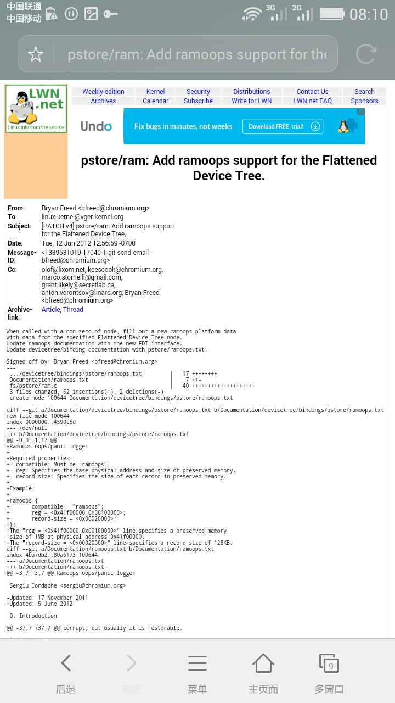
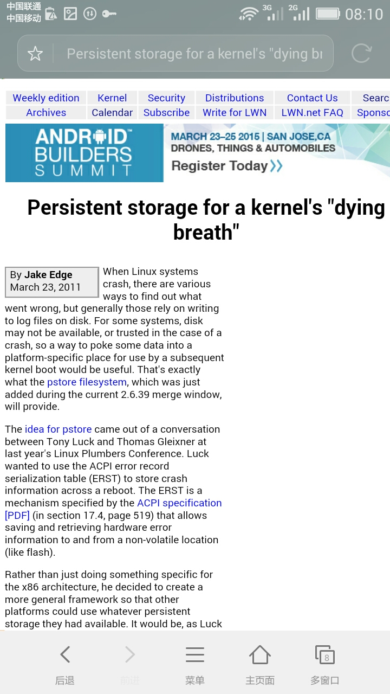

工作日志举例：“vi make”.
 
Kindle看信：gmane

结尾
====

三篇文章的最后的结尾可以考虑用haojunwei画的开源长河的图.  问junwei是否同意.

相关链接
http://sendtoreader.com/
kindle4rss
dogear
gae kindle

[IFTTT is pronunced like "gift" without the "g"](https://ifttt.com/wtf)

网站推荐：Infoq中文站。[订阅](newsletter@mailer.infoq.com)

参考资料
http://kernelnewbies.org
who write Linux 2015
[感觉是比较highlevel的参与社区方法](http://opensource.com/life/15/2/getting-involved-hfoss)
[一组如何参与开源社区的文章](http://opensource.com/resources/beginners-open-source)
[A developer's guide to getting into open source](http://opensource.com/life/15/2/developers-guide-getting-involved-open-source)

